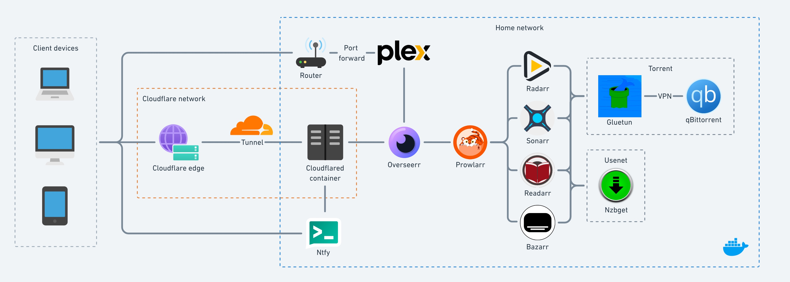

# Home Media Server

This is my automated home media server documentation.

## Prerequisites
- A Cloudflare account
- `docker` and `docker-compose` installed
- Linux OS preferred (e.g. Ubuntu 23.04)
- Access to your internet gateway user interface
- A domain name

## Tech stack

### Usenet
- FrugalUsenet (provider)
- DunkenSlug (indexer)
- NZBFinder (indexer)
- NZBgeek (optional indexer)

### Torrent 
- qBittorrent (downloader)

### Docker containers
- NZBget (downloader)
- Overseerr (automated content requester, integrates with Sonarr, Radarr and Plex)
- Plex (media server and player)
- Prowlarr (index manager for the *arrs)
- Radarr (movie grabber)
- Sonarr (TV show grabber)
- Bazarr (subtitle grabber)
- Readarr (ebook/audiobook grabber)
- Ntfy (notfications)
- Gluetun (VPN client)

### Authentication/Authorization
- Cloudflare Tunnel
- Cloudflare Access

### Audiobook App
- Prologue (connects with Plex)

### Notification App 
- Ntfy (available on iOS and Android)

## System Architecture


## Folder structure
There will be a folder for each docker container in `docker-compose.yml` so they can be blind mounted to. This is make backups and configurations easier to manage. 
```
home-media-server
├── docker-compose.yml
├── docker-compose.cftunnel.yml
├── docker-compose.ntfy.yml
├── docker-compose.gluetun.yml
├── .env
├── ntfy
├── qbittorrent
├── gluetun
├── nzbget
├── overseerr
├── plex
├── prowlarr
├── radarr
├── sonarr
├── bazarr
└── readarr
```

## Media folder structure 
This is your folder structure for all your media files (e.g. ~/media_files/). NZBGet will put all downloads in the `usenet` directory and the *arrs will move them in the corresponding folders in `libraries`. Plex will only be synced to the `libraries` directory.
```
media_files
├── usenet
├── torrents 
├── recycle 
└── libraries
    ├── movies
    ├── tv
    └── books
```

## Setup
### Docker containers
Configure the `.env` file and run the main docker compose file:
```
sudo docker compose up -d
```

### Plex
Configure this to remove the 1Mbps limit when watching media outside LAN.
1. Port forward 32400 to your media server in your router/modem.
1. Check that it's open using https://www.yougetsignal.com/tools/open-ports/.
1. Open 32400 in your OS's firewall settings:
    ```
    sudo ufw allow 32400
    ```
1. In Plex, go to Settings > Remote Access. Manually specify port 32400 and click Apply.

### Cloudflare Tunnel
1. Create a Cloudflare account and add your domain name (https://developers.cloudflare.com/fundamentals/get-started/setup/add-site/)
1. Go to SSL/TLS and select Full (strict) as encryption mode. 
1. Go to SSL/TLS > Edge Certificates and enable:
    - Always Use HTTPS
    - Automatic HTTPS Rewrites
1. Go to Cloudflare Zero Trust > Access > Tunnels and create a tunnel.
    - This is where you will get the `CF_TUNNEL_TOKEN` for your `.env`.
    - In Pubilc Hostname tab, create a hostname for each container. Note that the
    service URL is the **container's name** (e.g. `overseerr:5055`).
1. At this point, your containers are publicly accessible. Go to Cloudflare Zero Trust > Access > Access Groups and create an Access Group.
1. Go to Cloudflare Zero Trust > Access > Applications and add an application for each 
public hostname with the access group you created so it is under authentication. 

### Ntfy
Notifications to your phone are done using [ntfy](https://docs.ntfy.sh/). Note that your ntfy server should
not be under Cloudflare Access. Authentication should be configured using 
[Access Control Lists](https://docs.ntfy.sh/config/#access-control). Configure 
notifications for Radarr and Sonarr by setting up your `ntfy/.env` and 
going to Radarr/Sonarr > Settings > Connect > Add > Custom Script 
and select the corresponding script in `ntfy/`. 

### VPN + qBittorrent
If you want to torrent, you must use a VPN so your downloads are hidden
from your Internet Service Provider (ISP). The `docker-compose.glutun.yml` file
uses the gluetun container to connect to your VPN provider and the qBittorrent 
container sits behind gluetun so that all network goes through the VPN. 
This acts as an automatic kill switch -- if the VPN connection drops in gluetun, so does 
all internet capabilities for qBittorrent. A couple tips:
- Depending on your VPN, use a server dedicated for torrents or else it won't work. 
- You can test that the VPN is working in qBittorrent using [a torrent IP checker](https://torguard.net/checkmytorrentipaddress.php).
- Use [hardlinks](https://trash-guides.info/Hardlinks/Hardlinks-and-Instant-Moves/) so your downloads don't take double the disk space.
- Disable auto-seed by going to Settings > BitTorrent > When ratio reaches 0 > then **Pause torrent**.
  - Select Pause torrent instead of Removing torrent so Radarr/Sonarr can delete the torrent for you.
  - For more info, read [this](https://wiki.servarr.com/radarr/settings#completed-download-handling).

## Resources
- https://academy.pointtosource.com/containers/all-in-one-media-server-docker
- https://wiki.servarr.com/
- https://trash-guides.info/
- https://www.youtube.com/watch?v=GarMdDTAZJo
- https://dbt3ch.com/books/fail2ban/page/how-to-install-and-configure-fail2ban-to-work-with-nginx-proxy-manager
- https://geekscircuit.com/set-up-authentik-sso-with-nginx-proxy-manager
- https://www.youtube.com/watch?v=eojWaJQvqiw
- https://github.com/seanap/Plex-Audiobook-Guide
- https://docs.ntfy.sh/install/
- https://github.com/nickexyz/ntfy-shellscripts
- https://github.com/qdm12/gluetun-wiki/blob/main/setup/test-your-setup.md
- https://github.com/qbittorrent/search-plugins/wiki/Unofficial-search-plugins
